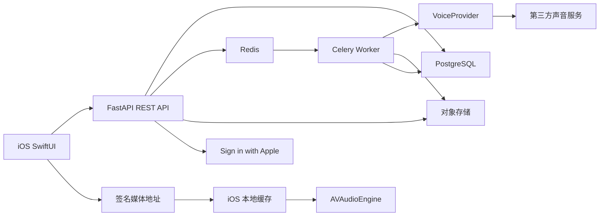
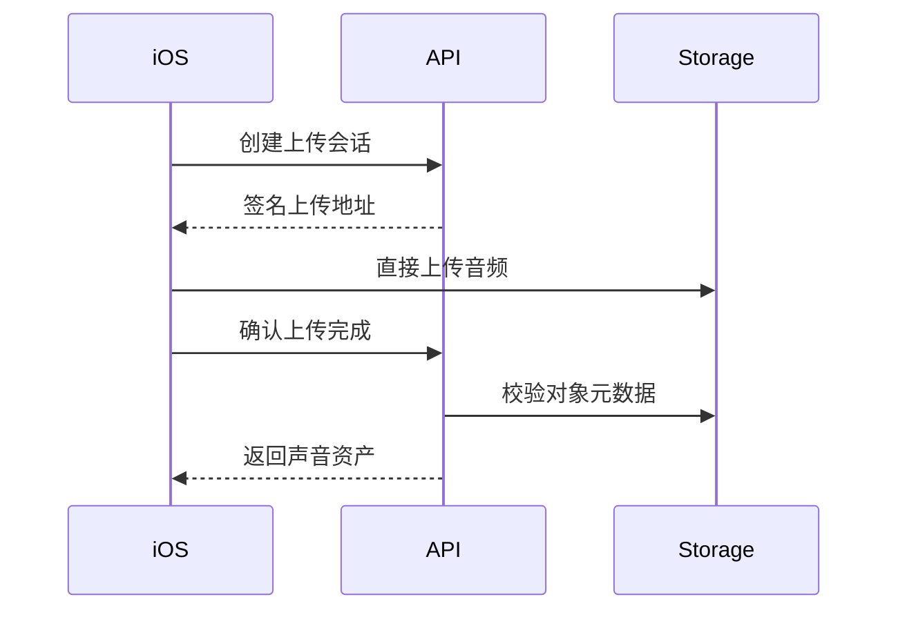

# DreamWeaver 生产后端技术方案与实施路线

版本：v1.2  
日期：2026-08-01  
状态：阶段 0–6 主路径完成；当前进行：阶段 7 PR1（陪伴事件上报与摘要 API）  
适用范围：iOS 客户端、服务器后端、音频处理、测试、部署与团队协作

## 1. 文档目的

本文档用于指导 DreamWeaver 从本地演示数据迁移到可持续迭代的生产后端。当前实现仍保留为离线演示与开发回退，新增服务器能力通过 Service Protocol 逐步接入，不直接重写 SwiftUI 页面和本地 `AVAudioEngine` 播放能力。

本文档的需求依据按以下优先级处理：

1. 第 15 节已确认的产品决策（优先于未确认的旧冲突描述）。
2. 当前 Git 前端目标分支 `feat/frontend-update`，基线提交 `495ac7d4a092751391ac0815ae4d20fdbcce5dd2`（作为迁移起点，不锁定最终信息架构）。
3. 当前 `feat/demo-backend` 中已经验证的本地多轨播放与服务协议。
4. 《DreamWeaver｜内部产品功能需求文档 v1.0》中的新增需求。
5. `intro.md` 与演示后端契约作为历史设计和迁移参考。

第 15 节原冲突项已于 2026-07-31 由产品确认；后端与后续前端改造以该节结论为准。

## 2. 产品与技术边界

DreamWeaver 是非医疗化的睡前放松与声音陪伴应用，不提供疾病诊断、治疗或医学级睡眠结论。

服务器负责：

- 用户身份、会话和设置；
- 官方场景、素材目录和场景音轨清单；
- 收藏、个人混音和私人场景同步；
- 录音与生成音频的元数据、授权和访问控制；
- 预签名上传、异步处理任务和第三方声音服务适配；
- 陪伴事件接收与统计摘要；
- 审计、删除、限流和可观测性。

iOS 客户端继续负责：

- `AVAudioSession` 和 `AVAudioEngine` 多轨播放；
- 声源拖动时的实时音量、声道和空间反馈；
- 场景时间线调度（按文本关键点或时间点触发声源动作）；
- 播放、暂停、睡眠定时和分层渐隐；
- 已下载音频的本地缓存与离线播放；
- SwiftUI 页面、动画与低延迟交互。

服务器不参与每一次拖动计算，也不远程混合正在播放的声源；时间线只下发版本化编排数据，由客户端执行。

## 3. 当前代码基线

现有调用链为：

```text
SwiftUI Views
  → AppState
  → Service Protocols
  → Local Services / DemoPersistenceStore
  → Bundle Mock Data / AVAudioEngine
```

可保留的核心：

- `ServiceProtocols.swift` 的服务边界；
- `DreamScene`、`SoundAsset`、`SoundSource` 等 Codable 模型；
- `LocalPlaybackService` 的多轨连续播放；
- 空间调音、定时停止和分层渐隐；
- 前端新的场景页、圆盘和声音库交互。

必须重构的部分：

- `AppState` 当前属性使用 `LocalContentService` 等具体类型，需改为协议注入；
- `AppState` 直接访问 `DemoPersistenceStore` 和 `MockDataService`；
- `resourceName` 只能解析 Bundle 文件，需支持远程存储键和本地缓存；
- 个人混音绕过 Service 层直接持久化；
- 演示重置、演示 UUID 和演示计时需要与生产配置隔离；
- 声音素材列表和场景可用基础声源仍硬编码在客户端。

## 4. 目标架构



架构原则：

- REST API 使用 `/v1` 版本前缀；
- 大文件由客户端直接上传对象存储；
- 长任务进入队列，API 不阻塞等待；
- 客户端只使用 DreamWeaver API，不保存第三方密钥；
- 供应商通过适配层替换；
- 数据库记录业务状态，对象存储保存二进制文件；
- 所有用户资源查询必须包含用户所有权校验；
- 生产服务与本地模拟实现共享同一业务契约。

## 5. 技术栈

### 5.1 API 服务

- Python；
- FastAPI；
- Pydantic；
- Uvicorn；
- REST JSON；
- OpenAPI。

FastAPI 负责请求路由、数据校验、认证依赖和自动接口文档。Pydantic 模型是服务器 API 契约，不直接与数据库 ORM 模型混用。

### 5.2 数据层

- PostgreSQL：正式业务数据；
- SQLAlchemy 2：数据访问；
- Alembic：数据库迁移；
- asyncpg：异步 PostgreSQL 驱动。

### 5.3 任务与缓存

- Redis：任务消息、缓存、限流与短期状态；
- Celery：声音分析、复刻、合成、转码与删除任务；
- 第一版客户端通过轮询获取任务状态，不引入 WebSocket。

### 5.4 媒体存储

- 本地开发：MinIO；
- 中国大陆生产：优先评估阿里云 OSS；
- CDN：正式公开内容分发；
- 用户私有音频仅通过短期签名 URL 访问。

### 5.5 工程与质量

- Docker / Docker Compose：统一本地依赖；
- pytest：单元与集成测试；
- Ruff：格式与静态检查；
- mypy：类型检查；
- GitHub Actions：持续集成；
- 结构化日志和请求 ID；
- 生产阶段接入云日志、告警和错误跟踪。

## 6. 仓库组织

三人团队初期采用单仓库，便于 iOS、API 契约和服务器代码同步：

```text
DreamWeaver/
├─ DreamWeaver/                  # iOS 应用
├─ server/
│  ├─ app/
│  │  ├─ api/v1/                # HTTP 路由
│  │  ├─ core/                  # 配置、安全、日志
│  │  ├─ db/                    # Session、ORM Base
│  │  ├─ models/                # 数据库模型
│  │  ├─ schemas/               # API 输入输出
│  │  ├─ repositories/          # 数据访问
│  │  ├─ services/              # 业务编排
│  │  ├─ providers/             # 对象存储、声音供应商
│  │  └─ workers/               # 异步任务
│  ├─ migrations/
│  ├─ tests/
│  ├─ pyproject.toml
│  └─ Dockerfile
├─ infra/
│  └─ docker-compose.yml
└─ docs/
```

后续团队扩大或权限边界变化时，再评估拆分独立服务器仓库。

## 7. 领域模型

### 7.1 身份

- `User`：内部用户 ID、昵称、状态和创建时间；
- `AppleIdentity`：Apple `sub` 与内部用户的绑定；
- `Session`：刷新令牌摘要、设备、过期与撤销状态；
- `UserSettings`：播放、显示、通知和默认场景设置。

### 7.2 官方内容

- `Scene`：名称、描述、分类、封面、推荐时长和可编辑性；
- `SceneTrack`：场景默认声源、空间位置、音量、循环和存储键；
- `MixPreset`：官方混音预设；
- `OfficialAsset`：官方环境音、生活音、触发音和官方人声。

### 7.3 用户状态

- `SceneUserState`：收藏、最近使用和使用次数；
- `PrivateScene`：从预设复制或从空白创建的个人场景（首期正式范围）；
- `PrivateSceneRevision`：显式保存产生的版本化编排内容（含声源布局与时间线）；
- `SceneDraft`：创建页未确认保存前的可选草稿（不替代正式版本）。

个人场景通过「创建」入口产生，保存后在「我的 → 已保存场景」复用。公开分享仍不进入首期。  
不再以“自动覆盖官方场景的 PersonalMix”作为正式产品主路径；若迁移阶段保留旧自动混音数据，仅作兼容读取。

### 7.4 声音资产

- `SoundAsset`：录音、生活音、声音包和处理版本；
- `UploadSession`：预签名上传和完成状态；
- `AssetDerivative`：原始音频、睡前处理版、预览和转码产物；
- `VoiceAuthorization`：授权主体、版本、范围、确认与撤回；
- `SeedJob`：质检、声音复刻或合成任务；
- `ProviderResource`：供应商侧 voice ID、job ID 和删除状态。

首期人声授权沿用当前创建者流程内确认，不强制亲友本人二次确认；授权记录、查看与撤回入口仍需保留。

### 7.5 场景编排

产品已确认采用场景时间线（非固定间隔人声触发）：

- `SceneCue`：触发时间或文本关键点；
- `CueAction`：播放、暂停、淡入、淡出、移动或替换声源；
- `Phrase`：低信息短句及审核状态；
- `VoiceBinding`：短句绑定的官方、系统或授权声音；
- `AutomationMode`：官方自动编排或用户手动覆盖。

当用户手动调整某个声源后，该声源退出官方自动编排，其他声源继续按时间线执行。实时执行仍由客户端完成，服务器只下发版本化时间线。

## 8. API 范围

### 8.1 基础与身份

```text
GET  /health
GET  /ready
POST /v1/auth/apple
POST /v1/auth/refresh
POST /v1/auth/logout
GET  /v1/bootstrap
```

### 8.2 官方场景与首页

```text
GET    /v1/home                     # 今晚推荐、最近使用
GET    /v1/scenes
GET    /v1/scenes/{sceneId}
PATCH  /v1/users/me/scene-states/{sceneId}   # 收藏、最近使用
GET    /v1/scenes/{sceneId}/palette
GET    /v1/scenes/{sceneId}/presets
GET    /v1/scenes/{sceneId}/timeline
```

### 8.3 个人场景（创建与显式保存）

```text
POST   /v1/scenes/{sceneId}/copy           # 从预设复制为个人场景草稿
POST   /v1/users/me/scenes                 # 空白创建
GET    /v1/users/me/scenes
GET    /v1/users/me/scenes/{sceneId}
PUT    /v1/users/me/scenes/{sceneId}/draft # 可选草稿
POST   /v1/users/me/scenes/{sceneId}/save  # 用户确认保存，生成正式版本
DELETE /v1/users/me/scenes/{sceneId}
```

创建或更改场景必须由用户点击保存后才成为可复用正式版本；拖动试听不自动发布新版本。

### 8.4 声音库与上传

```text
POST   /v1/uploads
POST   /v1/uploads/{uploadId}/complete
GET    /v1/library/assets
POST   /v1/library/assets
PATCH  /v1/library/assets/{assetId}
DELETE /v1/library/assets/{assetId}
POST   /v1/library/assets/{assetId}/favorite
GET    /v1/library/assets/{assetId}/playback-url
```

### 8.5 声音种子与异步任务

```text
POST   /v1/voice-authorizations
GET    /v1/voice-authorizations
POST   /v1/voice-authorizations/{authorizationId}/revoke
POST   /v1/seeds/analyze
POST   /v1/seeds/process
GET    /v1/seeds/jobs/{jobId}
POST   /v1/seeds/jobs/{jobId}/finalize
DELETE /v1/seeds/jobs/{jobId}
```

### 8.6 设置与陪伴记录

```text
GET  /v1/users/me/settings
PUT  /v1/users/me/settings
POST /v1/analytics/events
GET  /v1/analytics/summary
```

## 9. Sign in with Apple

生产流程：

1. iOS 使用 AuthenticationServices 获取 identity token 和 nonce；
2. 服务器根据 Apple 公钥验证签名；
3. 校验 issuer、audience、过期时间和 nonce；
4. 以 Apple `sub` 查找或创建内部用户；
5. 返回短期 access token 与可轮换 refresh token；
6. iOS 使用 Keychain 保存令牌；
7. 登出、密码状态变化或风险事件时撤销会话。

客户端传入的登录布尔值不构成认证依据。游客浏览和正式保存边界见第 15 节。

## 10. 文件上传与播放

上传流程：



约束：

- 限制 MIME、扩展名、时长和文件大小；
- 服务端不能只相信客户端提供的格式；
- 私有音频不得设置永久公网 URL；
- 播放 URL 短期有效，可重新签名；
- 删除资产前返回受影响场景；
- 确认删除后清理引用、衍生文件和供应商资源；
- 官方公共音频与用户私有音频使用不同前缀和访问策略。

## 11. 第三方声音服务

客户端不直接访问供应商。服务端定义：

```text
VoiceProvider
├─ analyze_sample
├─ create_voice
├─ synthesize
├─ get_job
├─ cancel_job
└─ delete_voice
```

开发阶段使用 `StubVoiceProvider`。供应商未确定前，不在业务层引用供应商字段。

候选供应商评估必须覆盖：

- 中国大陆可用地域；
- 企业认证与商业授权；
- 是否支持查询和删除音色；
- 样本、输出和模型数据保留期限；
- 亲友授权证明要求；
- 禁止对象和内容审核能力；
- 中文自然度、延迟、稳定性和价格；
- Webhook、轮询、并发和限流；
- 故障时是否可迁移已有资产。

## 12. 安全与合规

声音复刻可能涉及敏感个人信息和声纹相关风险。上线前必须进行专业法律与合规审查。

最低技术要求：

- 麦克风只在用户主动录音时调用；
- 人声复刻使用独立、明确、可撤回的授权；
- 自己声音与亲友声音使用不同授权流程；
- 禁止未授权第三方、名人和未成年人声线；
- 记录授权版本、主体、用途、时间和撤回；
- AI 生成声音在素材库和播放界面保持标识；
- 不提供声音包下载、公开分享和通用语音生成接口；
- API Key 仅保存在服务端密钥系统；
- 私有 Bucket、最小权限和短期签名 URL；
- 数据传输使用 TLS；
- 数据库敏感字段和备份加密；
- 管理操作和删除操作保留审计记录；
- 保存期限到期后执行可验证删除；
- 撤销授权后停止新的生成和播放授权，并清理关联资源。

## 13. 测试与验收

### 13.1 自动测试

- 配置加载与环境隔离；
- 健康检查；
- API Schema 与错误格式；
- Apple Token 验证边界；
- 用户资源所有权；
- 上传格式、大小和路径；
- 幂等任务创建；
- Job 状态机；
- 供应商超时、限流和失败重试；
- 授权撤回和删除级联；
- 混音保存与版本冲突；
- 数据库迁移升级和回滚。

### 13.2 客户端联调验收

- 无账号可加载允许游客访问的官方场景；
- 登录后收藏和个人混音可跨启动恢复；
- 远程音频缓存后可以连续多轨播放；
- 添加、删除或调整单个声源不重启其他声源；
- 单个音频下载失败不停止其他轨道；
- 上传、质检、授权、处理和试听状态正确；
- 网络中断后可恢复任务查询；
- 删除声音后不再出现在画布可选列表中。

## 14. Git 整合策略

目标前端提交：`495ac7d`。

当前 `feat/demo-backend` 有未提交改动，不能直接切换或合并。执行顺序：

1. 审查并在获得明确授权后提交当前演示后端；
2. 获取远程 `feat/frontend-update`；
3. 从前端目标提交创建集成分支；
4. 合并演示后端提交；
5. 手工处理 `AppState.swift`、`SoundMixCircleEditor.swift`、`AppEnums.swift`、`SettingsView.swift`、`SceneLibraryView.swift` 和 `SeedCreationFlow.swift`；
6. 接受前端删除 `SceneDetailSheet.swift` 与 `ScenePreviewView.swift` 的结构，不恢复旧页面；
7. 将本地播放和 Service Protocol 能力迁入新的前端调用点；
8. 完成模拟器、真机、离线和连续播放回归；
9. 通过 Pull Request 合入主分支，不直接在 `main` 开发。

服务器代码可以先在当前工作区搭建，但在 Git 整合时作为独立提交迁移到集成分支。

## 15. 产品冲突确认结论（2026-07-31）

原“待确认冲突”已由产品回复确认。以下为正式基线。

### 15.1 信息架构 — 采用新产品五入口

正式一级入口：

| 一级入口 | 二级页面/模块 | 用户在此完成的事 |
| --- | --- | --- |
| 首页 | 今晚推荐、最近使用、快速播放 | 快速进入一套场景或继续上次场景 |
| 场景 | 预设场景列表、场景详情 | 浏览、预听、收藏并启动预设场景 |
| 创建 | 文本、人声、素材、保存 | 从空白创建自定义场景，或调整预设后保存为个人场景 |
| 素材库 | 官方素材、我的生活音、我的人声 | 管理可加入场景的声音资产 |
| 我的 | 已保存场景、收藏、授权与隐私、设置、联动设备 | 复用个人内容并管理权限 |

说明：

- 空间画布不再作为独立一级入口，归入「创建」流程；
- 「此刻」仍是播放中的沉浸体验页，由场景进入或首页快速播放到达，不作为底部一级入口；
- 当前四入口前端是迁移起点，需按本表演进；
- 后端 API 继续按资源建模（home、scenes、private scenes、library、settings），不绑定 Tab 实现细节。

### 15.2 场景进入方式 — 采用当前前端

点击场景卡直接进入「此刻」。

后端仍提供场景详情与预听资源，供「场景」页浏览与详情展示，但不要求“先详情再播放”的强制路径。

### 15.3 私人场景 — 纳入首期，归属「创建」

详见 15.1「创建」：

- 支持从空白创建个人场景；
- 支持调整预设后保存为独立个人场景；
- 保存结果进入「我的 → 已保存场景」；
- 首期不提供公开社区分享。

后端将 `PrivateScene` / `PrivateSceneRevision` 作为正式 MVP 能力，不再仅预留。

### 15.4 保存方式 — 必须显式确认保存

创建或更改场景需要用户点击保存后才生效为正式版本。

- 拖动、试听、临时调整不自动发布；
- 可保留本地/服务端草稿，但不替代确认保存；
- 正式版本用于再次打开、最近使用和已保存场景列表。

### 15.5 定时选项 — 采用当前实现

保持：

- 适时停止；
- 10 分钟；
- 30 分钟；
- 60 分钟；
- 一直播放；
- 演示加速仅用于演示/Debug，不进入正式产品选项。

不采用最新需求中的 15/30/45/60 与自定义时长方案。  
后端仍以秒数表达时长，避免把 UI 枚举写死进数据库。

### 15.6 声源删除 — 采用最新需求

支持删除声源，并在删除时二次确认。

- 取消“圆内至少一个声源、最后一个不可拖出”的硬限制；
- 删除操作不得误删整个场景；
- 保存正式版本时，若声源为空，客户端与服务器需给出明确校验或提示（建议至少保留一个可播放声源，具体文案由产品补齐）。

### 15.7 人声授权 — 采用当前流程

沿用当前声音种子：由创建者在流程中确认授权。

- 首期不强制亲友声音本人独立二次确认；
- 「我的 → 授权与隐私」仍需展示授权记录、用途说明、撤回和删除入口；
- 后续若升级亲友本人确认，再扩展授权主体模型，不阻塞当前 MVP。

### 15.8 场景时间线 — 采用最新需求

采用按文本进度或时间点控制声源出现、减弱、结束和空间位置的时间线模型。

- 服务器下发版本化时间线；
- 客户端执行调度；
- 用户手动修改过的声源退出自动编排，其余声源继续按时间线执行；
- 可在内容、登录、上传 API 之后分阶段落地，但契约与数据模型需尽早定义。

## 16. 实施阶段

进度说明（2026-08-02）：阶段 **0–6** 已合入 `integration/frontend-backend`（含时间线契约、私人快照、`SceneTimelineScheduler`、洗头脚本 v4）。当前进行：**阶段 7 PR1**（`POST /v1/analytics/events`、`GET /v1/analytics/summary` 与 iOS `RemoteAnalyticsService`）。

### 阶段 0：代码保护与前端整合 — 完成

- 保存当前演示后端成果；
- 合并前端基线；
- 恢复可编译、可连续播放的统一基线。

### 阶段 1：服务器基础 — 完成

- FastAPI 项目；
- 环境配置；
- 健康检查；
- PostgreSQL、Redis、MinIO；
- Celery Worker；
- 测试与 Docker Compose。

### 阶段 2：身份与官方内容 — 完成

- Sign in with Apple（JWKS + 开发 `dev:`）；
- Bootstrap；
- 场景列表、详情、音轨和预设；
- iOS `RemoteContentService`。

### 阶段 3：首页、收藏与个人场景 — 主路径完成

- 首页推荐与最近使用；
- 场景收藏；
- 从预设复制 / 空白创建个人场景；
- 草稿与显式保存版本；
- 设置同步；
- ~~离线队列和冲突策略~~ → **延后**（仅契约文档）。

### 阶段 4：上传与声音资产 — 完成

- 预签名上传；
- 元数据校验；
- 素材库 CRUD（官方素材、生活音、人声）；
- 私有播放地址；
- 删除影响检查与二次确认所需的影响范围数据；
- iOS `RemoteUserLibraryService`。

### 阶段 5：授权与声音处理 — 基本完成

- 创建者流程内授权记录；
- SeedJob；
- Worker（骨架）；
- Stub 供应商；
- 撤回和删除闭环（级联取消任务 / 软删资产 / scrub 场景）；
- 候选供应商 PoC（后续）。

### 阶段 6：场景时间线与播放编排 — 完成

- 时间线 / Cue / Phrase 契约（见 `docs/scene-timeline-contract.md`）；
- 官方自动编排与用户覆盖规则（`override_policy=per_source_manual_exit` + `manual_override_track_ids`）；
- 私人场景 `draft_timeline` / `saved_timeline` 快照；
- 客户端 `SceneTimelineScheduler` 接入 `AVAudioEngine`，替换固定 6s/28s 人声 Timer；
- 洗头陪伴官方时间线脚本 v4（约 620s，`play_oneshot` / 分层 cue）。

### 阶段 7：陪伴记录与可观测性 — 完成

- 事件批量上报（PR1：`POST /v1/analytics/events`）；
- 陪伴摘要（PR1：`GET /v1/analytics/summary`，对齐 `UsageRecord`）；
- 结构化 JSON 日志与 `X-Request-ID`（PR2）；
- 进程内 `/metrics`（Prometheus 文本）与 `audit_events` 敏感操作审计（PR2）；
- 云日志 / 告警 / 错误跟踪：阶段 8 部署时接入。

### 阶段 8：中国大陆部署

- 企业主体和云账号；
- 域名与备案；
- RDS PostgreSQL；
- Tair/Redis；
- OSS 与 CDN；
- ECS 或 SAE；
- HTTPS、备份和灾难恢复；
- 隐私与合规审核。

## 17. 当前阶段完成定义

第一阶段后端基础完成需满足：

- 新成员可根据 README 启动 API；
- `/health` 返回服务状态；
- 配置不包含真实密钥；
- PostgreSQL、Redis 和对象存储有本地开发配置；
- Worker 可启动并执行测试任务；
- OpenAPI 可访问；
- 测试可在本地和 CI 重复运行；
- 目录允许继续增加认证、场景和上传模块；
- 不破坏现有 iOS 演示后端与播放代码。

