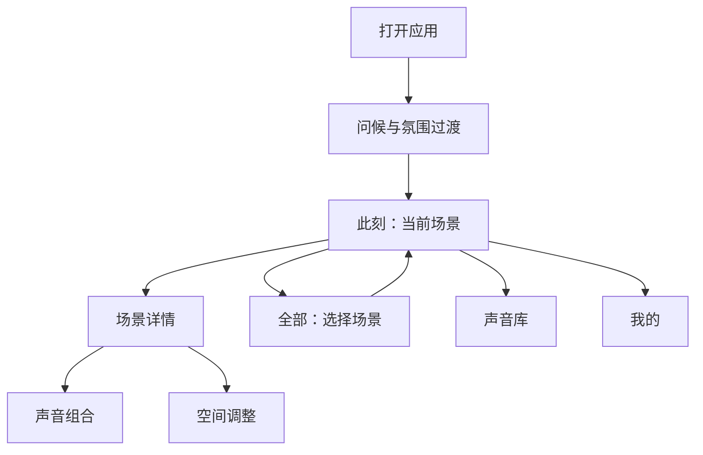
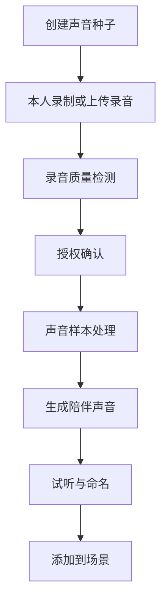
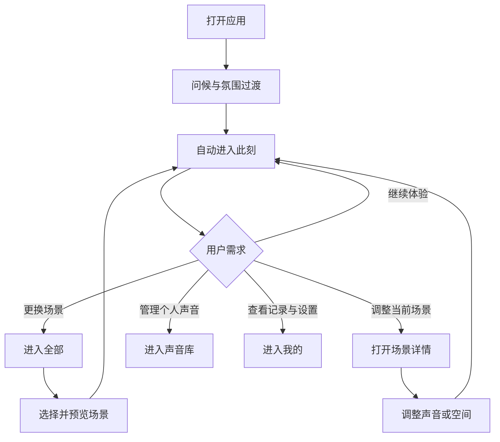

# 织梦（DreamWeaver）App 页面与功能设计总结

## 一、产品定位

织梦是一款以“场景”为核心的沉浸式助眠应用。

用户打开应用，不是在选择一段音频，而是进入一个已经准备好的梦境空间。产品通过场景画面、氛围动画、空间声音和熟悉的人声，营造自然、温和的睡前陪伴体验。

## 二、设计原则

- 采用简洁、克制的 iOS 视觉风格
- 强调沉浸感与情绪体验
- 减少操作步骤和选择压力
- 根据用户习惯自动准备场景
- 隐藏专业音频参数
- 使用场景与感受语言替代技术语言
- 沉浸页面减少按钮和文字干扰
- 复杂调整集中在二级页面完成

界面不展示底层生成方式和技术名称，统一使用“为你准备”“陪伴声音”“声音种子”等用户容易理解的表达。

## 三、整体页面架构

底部导航栏设置四个入口：

| 导航入口 | 页面定位 | 核心功能 |
|---|---|---|
| 此刻 | 当前正在播放的梦境空间 | 沉浸体验、播放控制、场景调整 |
| 全部 | 浏览与选择全部场景 | 分类、常用、搜索、场景预览 |
| 声音库 | 管理个人声音资产 | 录音、声音种子、收藏、上传 |
| 我的 | 账户、数据与设置 | 使用记录、会员、隐私、基础设置 |

## 四、进入梦境

### 4.1 页面定位

“进入梦境”不是传统加载页面，而是从现实状态过渡到梦境空间的情绪缓冲，建议停留1.5—3秒。

### 4.2 页面内容

1. 个性化问候  
   随机展示简短、温和的问候语。

2. 氛围动画  
   使用缓慢变化的渐变、柔和光晕或流动色块，不显示传统进度条和加载百分比。

3. 初始场景准备  
   根据最近使用场景、常用声音组合、常用播放时间、收藏与常用场景以及上次播放状态准备场景。

4. 场景进入优先级  
   恢复上次正在播放的场景 → 近期最常使用的场景 → 当晚推荐场景 → 首次使用的默认场景。

5. 场景过渡  
   问候语淡出，场景画面与声音同步渐入，随后进入“此刻”。

## 五、此刻

### 5.1 页面定位

“此刻”是应用的核心沉浸页面，主要呈现场景视觉、空间声音、氛围动画和当前陪伴状态，避免长期显示大量按钮、列表和说明文字。

### 5.2 页面内容

- 全屏动态场景视觉
- 场景名称与一句描述，进入时短暂显示后自动淡出
- 空间声音播放
- 播放与暂停
- 后台及锁屏继续播放
- 锁屏界面基础控制
- 场景声音渐入渐出

场景示例包括：

- 檐下听雨
- 深林萤火
- 雾岸听潮
- 渔家灯火
- 幽谷清流

### 5.3 沉浸交互

- 单击屏幕：显示或隐藏基础控件，包括左上角“此刻”
- 上滑或拖动底部把手：展开场景详情
- 长按屏幕中间区域：展开场景详情
- 无操作约5秒：隐藏控件和底部导航
- 再次触摸：恢复控件和底部导航
- 场景详情无操作约15秒：自动收起

## 六、全部

### 6.1 页面定位

用于浏览、筛选和选择梦境场景。

### 6.2 页面结构

顶部包含：

- 页面标题
- 搜索入口
- 场景分类标签

分类包括常用、自然、雨夜、海洋、森林、人声、陪伴、呼吸、轻音乐、耳语与触发音，默认进入“常用”。

### 6.3 场景排列

- “常用”按照使用频率和最近使用时间排列
- 其他分类可按照推荐顺序、热度顺序、最近更新或场景名称排列

### 6.4 场景卡片

卡片包含场景封面、场景名称、一句话描述、收藏状态和播放状态。点击卡片后先进入预览，不立即替换当前场景。

### 6.5 场景预览

包含：

- 动态封面
- 场景名称与介绍
- 主要声音组成
- 声音片段试听
- 收藏或添加至常用
- “进入梦境”按钮

点击“进入梦境”后，旧场景声音降低、画面变暗，新场景画面与声音平滑渐入，并直接返回“此刻”。

## 七、场景详情

### 7.1 页面定位

“此刻”负责沉浸，场景详情负责控制。详情采用 iOS Bottom Sheet 形式，不进行完整页面跳转。

### 7.2 呼出与收起

呼出方式：

- 长按屏幕中部
- 点击基础控件区域
- 上拉底部把手

收起方式：

- 下拉详情面板
- 点击面板外的场景区域
- 无操作约15秒自动收起

### 7.3 场景信息

- 场景名称
- 场景简介
- 当前收听人数
- 收藏场景

### 7.4 定时停止

提供：

- 适时停止
- 10分钟后
- 30分钟后
- 1小时后
- 一直播放

选择10分钟、30分钟或1小时后，按钮通过百分比填充呈现计时进度，不显示数字。切换计时状态或计时结束后及时刷新状态。

“适时停止”需要说明其触发逻辑，例如根据设定时间、设备状态或持续播放时长逐渐停止。

## 八、声音组合与空间调整

### 8.1 功能定位

用于调整当前场景中的声音组成、声音位置和声音大小，不向用户展示复杂的专业参数。

### 8.2 二维声音空间

- 使用二维圆形图呈现声音空间
- 正在播放的声源放置在圆形图内
- 通过拖动调整声音位置和大小
- 未播放但可使用的声源排列在圆形图下方
- 将声源拖入圆形图即可添加，拖出即可删除
- 同一个声源可以重复使用
- 调整后自动保存，不设置“完成”按钮
- 拖动过程中实时试听声音变化

### 8.3 声源类型

包括人声陪伴、雨声、风声、海浪、鸟声、虫鸣、钢琴、呼吸引导、环境背景音、用户录音、亲友声音种子和合成陪伴声音。

每个声源提供音量滑块，并通过图标、名称和空间方向进行识别。

### 8.4 “我的”与预设

- 在官方预设前增加“我的”
- 只有“我的”允许用户自行修改
- 官方预设不能修改
- 切换预设不会清空“我的”设置
- 支持一键应用官方预设

### 8.5 声源使用范围

每个场景可使用的基础声源不同，例如树林场景不能使用海浪基础声源；用户已收藏的声源可以跨场景通用。

### 8.6 自动处理内容

系统根据声源位置自动处理音量变化、左右声道、距离衰减、混响、细微延迟和整体空间感，用户无需接触专业参数。

## 九、声音库

### 9.1 页面定位

用于创建、上传、收藏和管理个人声音资产。

### 9.2 页面分类

- 我的：我的录音、我的声音种子
- 社区
- 收藏声音

我的录音处理完成后进入“我的声音种子”。只有收藏的声音和基础声音可以直接在声源添加界面调用。

### 9.3 主要入口

- 录制声音
- 上传本地文件
- 创建声音种子

### 9.4 声音种子流程

具体功能包括录制或上传、质量检测、朗读提示、授权确认、样本处理、进度展示、结果试听、重新生成、命名、设置人物关系、添加至场景、删除资产和撤销授权。

### 9.5 声音管理

- 试听与暂停
- 重命名与分类
- 收藏
- 查看详情
- 添加到场景
- 下载或导出
- 删除
- 批量管理

涉及亲友声音时，需要明确展示授权状态、使用范围和删除入口。

## 十、我的

### 10.1 个人账户

- 用户头像与昵称
- 登录与退出
- Apple账户登录
- 会员状态
- 订阅管理
- 隐私与安全

### 10.2 陪伴记录

- 累计使用时长
- 本周使用时长
- 常用入睡时间
- 睡眠趋势

如果数据主要来自应用使用行为，统一使用“陪伴记录”，避免让用户误以为产品提供医学级睡眠分析。

## 十一、基础设置

### 11.1 播放设置

默认进入场景、自动播放、后台播放、锁屏控制、音频质量和定时停止默认选项。

### 11.2 显示与体验

深色模式、动画强度、减少动态效果、辅助功能和通知设置。

### 11.3 存储与权限

下载与存储管理、麦克风权限、本地文件访问权限和隐私权限管理。

### 11.4 关于与支持

用户协议、隐私政策、声音授权说明、意见反馈和关于织梦。

## 十二、场景方案保存与分享

该部分属于后续功能，不纳入首版主要范围，包括：

- 保存自定义场景方案
- 设置名称与封面
- 保存声音组合和空间布局
- 导出双耳音频版本
- 浏览、收藏和应用其他用户方案
- 设置公开范围
- 举报不适当内容

## 十三、完整用户流程

核心体验概括为：

**打开应用，进入“此刻”；想更换梦境时浏览“全部”；想加入熟悉的声音时进入“声音库”；个人记录与设置集中在“我的”。**

## 十四、需要确认的问题

1. 比较“全部”和“梦境”两个导航名称，确认哪个更容易理解。
2. 15秒自动收起仅适用于场景详情、声音调整和空间预览，不用于录音、上传、授权及设置页面。
3. 长按呼出详情不能作为唯一入口，需要同时保留上拉把手或单击入口。